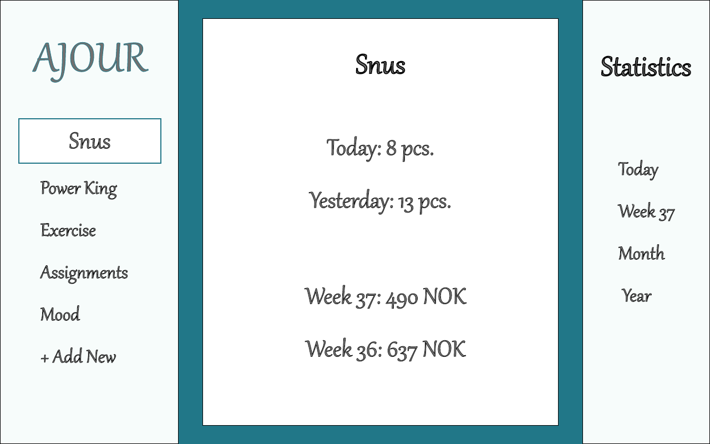
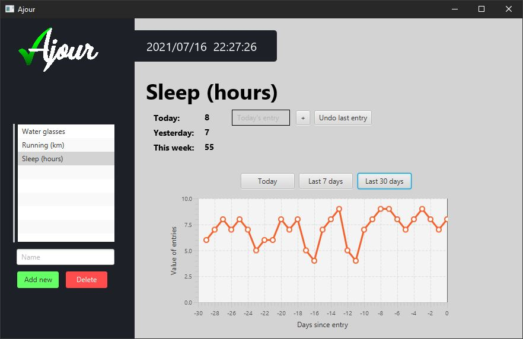

# Group gr2012 repository

Link til vårt repo: 

## Beskrivelse av repo-innholdet
#### Moduler
Prosjektet er bygget med maven, og er strukturert slik at ajour med tilhørende pom-fil er parent-modul, med følgende submoduler: 

- [**core:**](ajour/core/README.md) Her ligger domenelogikken og lagring med json. 
- [**fxgui:**](ajour/fxgui/README.md) Her ligger javafx-kode for ui, med nødvendige ressursfiler, slik som fxml og logo som brukes i gui. 
- [**restserver:**](ajour/restserver/README.md) Her ligger kildekode for server satt opp vha. Spring Boot
 , samt konfigurasjonsfiler
- [**integrationtests**](ajour/integrationtests/README.md) Her ligger integrasjonstestene, med konfigurasjon som starter server, 
kjører testene under src/test, og stopper serveren. 

#### Vårt bygg har tillegg for:

- testing (**maven-surefire-plugin**)
- integrasjonstesting med (**maven-failsafe-plugin**)
- kjøring av JavaFx (**javafx-maven-plugin**)
- testing av JavaFx (**testfx-junit5**)
- testdekningsgrad med [jacoco](https://github.com/jacoco/jacoco) (**jacoco-maven-plugin**)
- sjekk for bugs med [SpotBugs](https://github.com/spotbugs/spotbugs) (**spotbugs-maven-plugin**)
- sjekk av kodestil med [CheckStyle](https://github.com/apache/maven-checkstyle-plugin) (**maven-checkstyle-plugin**)
- kjøring av server med [Spring-boot](https://github.com/spring-projects/spring-boot) (**spotbugs-maven-plugin**)

#### Oppstart og testing

For å starte appen i nytt workspace, ev. etter førstegangsimport i IDE:
- mvn install
- mvn spring-boot:run -f restserver
- mvn javafx:run -f fxgui

Tester kan kjøres med:
- mvn test

Etter mvn verify og install vil jacoco lage to rapporter; vanlig rapport som dekker modulen som
er testet, samt en rapport for dekningsgraden til modulene den er avhengig av. Modulen fxgui vil inneholde
aggregate-rapport for core, og integrationtests vil kun ha en aggregate-rapport som dekker hele prosjektet.

I mappen [MockupPics](documentation/mockupPics)
 er det bilder som illustrer hvordan vi ser for oss 
hvordan appen skal se ut når den er ferdig. 

#### Diagrammer
[Her](documentation/UML) kan man finne PlantUML diagrammer i både svg og puml-format:
- Klassediagram (full og simpel)
- Pakkediagram
- Sekvensdiagram

Klassediagrammene vises også i modulenes respektive readme.md. 

#### Mockup
I [MockupPics](documentation/mockupPics) er det bilder som illustrerer hvordan vi planla
 at appen skulle se ut når den ble ferdig. 
Forandringer fra prosjektets orginale planer har blitt logget i [changelog](documentation/changelog.md).

Under vises et eksempelbilde på hvordan appen skal se ut når bruker har valgt ''Snus'': 

  

# Ferdig produkt 

Under ser man hvordan appen endte opp med 'søvn' valgt som et eksempel på tracking element.

