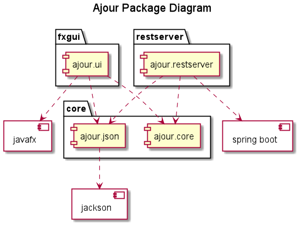

### AJOUR

Funksjonaliteten til appen er å "tracke" aktiviteter en bruker ønsker å følge med på, og visualisere det for 
brukeren. Dette kan eksempelvis være at bruker logger sitt snusforbruk, inntak av PowerKing eller TV-titting. 
Du kan lese [brukerhistorier](../documentation/Userstories.md) for å se mer av bakgrunnen for appen. 
 

### Beskrivelse av arkitekturen 

Prosjektet har full tre-lags arkitektur; domenelag, brukergrensesnittlag og persistenslag.
 
I tillegg benytter brukergrensesnittet et API for å kommunisere med domenelaget gjennom en restserver.
Domenelogikken ligger i **core**, brukergrensesnittet ligger i **fxgui**, og restserver ligger i **restserver**. 
Prosjektet er satt opp med persistens med Jackson-tillegget, som leser/lagrer til/fra JSON-format ved hjelp av
klassene i JSON-pakken.

Brukerdata kan lagres i json-filer både lokalt og på server, standardvalg her er via server, men appen
kan settes til å benytte lokal lagring. Appen har en implisitt lagringsmodell, som betyr at det lagres 
underveis i takt med at man interagerer med appen.

### Diagrammer

Relevante diagrammer ligger i [UML](../documentation/UML/) under documentation, deriblant: 
- [klassediagram](../documentation/UML/ClassDiagrams/AjourClassDiagram.png) for Ajour.
- [forenklet klassediagram](../documentation/UML/ClassDiagrams/SimpleAjourClassDiagram.png) for Ajour. 
- [sekvensdiagram](../documentation/UML/SequenceDiagram.png) for et kall til addEntry.  

Under vises pakkediagram for appen. 

 

 
 

