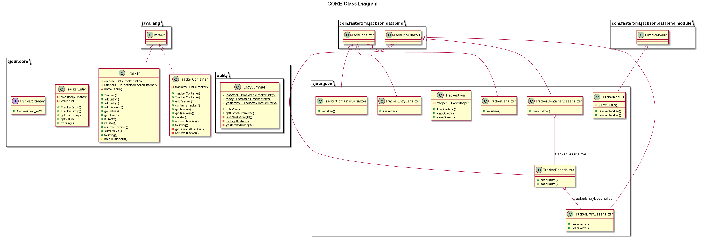

# core

Inne i **core** har **ajour.core** domenelogikken, med følgende klasser: 

**core**-pakke:
- Tracker-klassen inneholder alle entries i en liste, med mulighet for å legge til flere. 
Denne klassen lar brukeren opprette en Tracker som knyttes til et bestemt navn.

- TrackerContainer-klassen tar vare på de ulike Tracker-objektene i en liste. 
Her kan man legge til eller fjerne Tracker-objekter fra TrackerContainer. 
Denne brukes for å samle samtlige Tracker-objekter som UI og server skal oppbevare,
som er praktisk når samtlige Tracker-objekter skal parses, samt ved lagring og skriving til/fra fil.

- TrackerEntry er en verdiklasse, som består av en int-verdi og en timestamp representert med java.time.Instant. 
Denne klassen brukes for å legge inn verdier i et Tracker-objekt for å loggføre brukerens registreringer.

- TrackerListener er et funksjonelt interface som kan implementeres av klasser som ønsker å få beskjed om endringer av Tracker-objekt.

- I core ligger det en **utility** pakke:
    - EntrySummer har statiske metoder for å summere verdiene til alle TrackerEntry-objekter fra en angitt Tracker, med et predikat som input som beskriver tidsrom. 

Her ligger også **ajour.json** pakken for lagring. Denne pakken består av serializers og deserializers for samtlige klasser utenom EntrySummer.
Disse blir samlet i TrackerModule, som kan brukes av TrackerJson for lagring til og henting fra JSON-fil. Denne modulen
brukes også i restserver-modulen for å serialisere/deserialisere klassene fra core.

