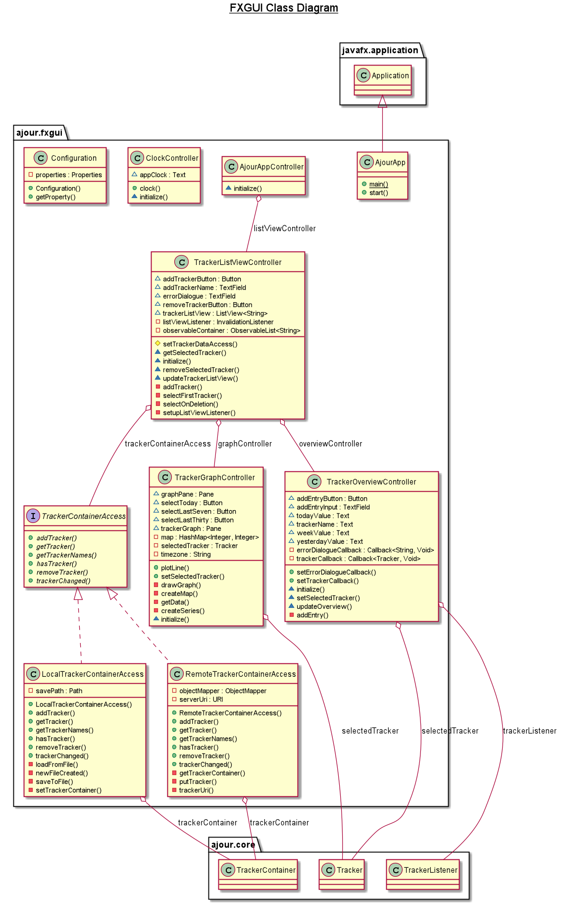

# fxgui

Ajour har en implisitt lagringsmodell, og data lagres/sendes til server underveis, i takt med at man interagerer med appen.

Inne i **fxgui** har **ajour.ui** følgene klasser: 

- AjourApp.java launcher programmet; Starter FXML og controllere. 

- AjourAppController.java initialiserer containerAccess ved å sjekke **ajour.properties** ved hjelp av Configuration-klassen. 
Hvis riktig nøkkel er satt, vil den bruke RemoteTrackerContainerAccess som datatilgang, hvis ikke kjører den lokalt.

- ClockController.java er en controller for klokken i UI-et.

- Configuration.java initialiserer et Properties objekt lastet opp fra **ajour.properties** i resources.
Dette gjør at vi kan sette forskjellige paths og filnavn for appen når den kjører med testene.

- TrackerContainerAccess.java er et interface som abstraherer ut tilgangen og behandling av den underliggende
datastrukturen

    - LocalTrackerContainerAccess.java er en implementasjon som delegerer metodekall til en TrackerContainer, samt
    skriver til fil ved endring, og ev. laster inn en TrackerContainer fra en JSON-fil ved oppstart om denne finnes.

    - RemoteTrackerContainerAccess.java sin implementering sender og mottar data i form av serialiserte Tracker- og
    TrackerContainer-objekter til en REST-server, men har også en lokal TrackerContainer som oppdateres fortløpende for
    å minimere antall GET-requests, mer spesifikt for å minimere antall kall når UI etterspør navnene til Tracker-objekter
    som ligger på serveren.
    
- TrackerListViewController.java er en controller for oversikten på Tracker-objekter brukeren har lagt inn. Det er også
denne kontrolleren som benytter TrackerContainerAccess, og som videre gjør data fra denne tilgjengelig for TrackerGraphController
og TrackerOverViewController ved å videresende Tracker-objektet som er valgt.

    - TrackerGraphController.java bruker det valgte Tracker-objektet og tegner en LineChart-graf for verdiene over tidsintervallet man ønsker å se. 

    - TrackerOverviewController.java er en controller for oversikten brukeren har på det valgte Tracker-objektet.
    Her ser man entries for i dag, i går og denne uken. Man kan også legge til og eventuelt gjøre om entries. 

Under **resources** finner man FXML-filene som brukes av appen, og en fil med innstillinger for savePaths, serverURI og hvilken
TrackerContainerAccess appen skal bruke.

## Merknad for kjøring av integrasjons- og UI-tester:
Vi har så langt det lar seg gjøre skrevet testene slik at disse skal kjøre konsekvent uavhengig av om
de kjører på laptop, workstations eller gjennom gitpod. Ved feil av typen: "NoSuchElementException" eller
lignende fra FXrobot, burde man først forsøke å kjøre testene på nytt. Dette skal være tatt høyde
for ved hjelp av waitForFxEvents(), som passer på at UI er ferdig med alle metodekall før neste del av koden
kjører.

