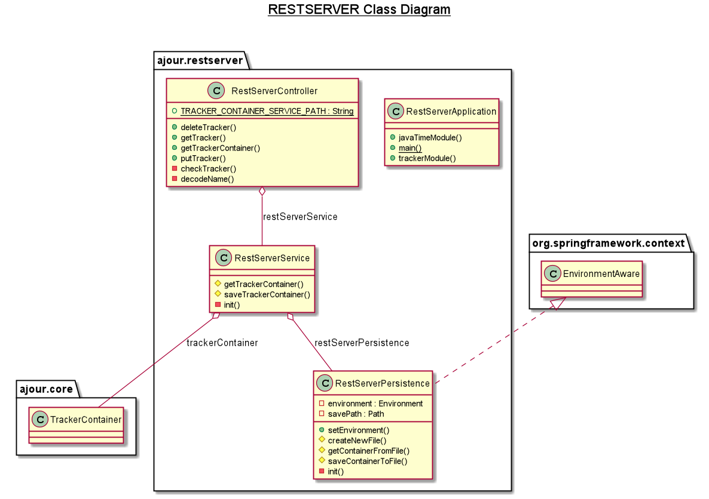

# restserver

Vår restserver er en Spring Boot-applikasjon, hvor rest-API/mappings for HTTP-requests er definert i RestServerController.

Inne i **restserver** finner man følgende klasser: 

- RestServerApplication.java inneholder startmetoden for serverapplikasjonen. Det er også her konfigurering av Spring sin
ObjectMapper for JSON skjer, for å håndtere parsing av klassene fra core-modulen.

- RestServerController.java gjør serveren i stand til å lytte etter HTTP-requests og bestemmer hvordan disse skal behandles. 

- RestServerService.java brukes av kontrolleren for å håndtere Tracker-objekter som blir tilsendt eller forespurt av
klienten. 

- RestServerPersistence.java tilbyr lagring og innlasting, slik at det underliggende TrackerContainer-objektet i
RestServerService-klassen kan gjenopprettes om serveren må startes på nytt.

I denne modulen finner man også filer med konfigurasjon for serveren under **resources**, som hvilken port og lagringslokasjon
serveren skal benytte. I tillegg til application.properties, som benyttes ved all kjøring, så er det også en
application-test.properties, som benyttes under testene, både i denne modulen, samt integrationtests.

